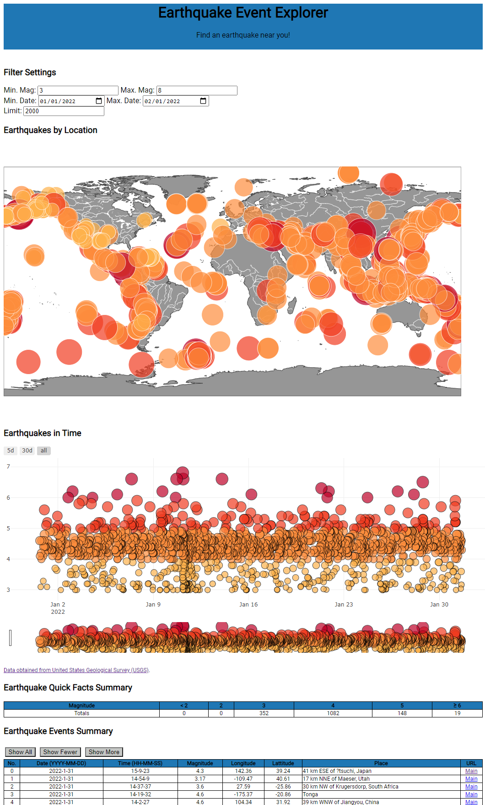

# Earthquake Events Explorer Web App

#### Author: Kevin Kuei
#### Video Demo: <https://youtu.be/UtqkkDnp7Xw>
#### Description: 

### CS50x Final Project (also, my first time making a markdown file on Github!)

Per the course website <https://cs50.harvard.edu/x/2021/project/>:

>The climax of this course is its final project. The final project is your opportunity to take your newfound savvy with programming out for a spin and develop your very own piece of software. So long as your project draws upon this course’s lessons, the nature of your project is entirely up to you. You may implement your project in any language(s). You are welcome to utilize infrastructure other than the CS50 IDE. All that we ask is that you build something of interest to you, that you solve an actual problem, that you impact your community, or that you change the world. Strive to create something that outlives this course.
>
>Inasmuch as software development is rarely a one-person effort, you are allowed an opportunity to collaborate with one or two classmates for this final project. Needless to say, it is expected that every student in any such group contribute equally to the design and implementation of that group’s project. Moreover, it is expected that the scope of a two- or three-person group’s project be, respectively, twice or thrice that of a typical one-person project. A one-person project, mind you, should entail more time and effort than is required by each of the course’s problem sets.
>
>Creating an entire project may seem daunting. Here are some questions that you should think about as you start:
>
  > * What will your software do? What features will it have? How will it be executed?
  > * What new skills will you need to acquire? What topics will you need to research?
  > * If working with one or two classmates, who will do what?
  > * In the world of software, most everything takes longer to implement than you expect. And so it’s not uncommon to accomplish less in a fixed amount of time than you hope. What might you consider to be a good outcome for your project? A better outcome? The best outcome?

### The Application

* It's a simple web-based application built with vanilla HTML, CSS, and JavaScript that interfaces with the United States Geological Survey (USGS) API to retrieve GEOJSON data about earthquakes. 
* The application then plots and summarizes the results for a given query on the webpage. 
* The user can dynamically interact with the data to explore earthquakes near them in space and time, and apply some simple filter criteria to the request.

### How it Works

* The user specifies search filter criteria for earthquake events
* Any value change in filter criteria triggers a callback which fetches new data with a HTTP request to the USGS API
* The returned data is parsed into a usable format
* That data is then plotted graphically in space and time
* Metadata and summary statistics are tabulated

### Inspiration / Context

* I'm a geotechnical engineer who does a lot of earthquake modelling, so I thought a simple application to view and manipulate earthquake data seemed like a good starting place. 

* For the application, I also wanted to keep things simple, because even simple ideas, can be layered upon to make them more interesting/challenging. With this in mind, the idea was to build an application which would retrieve data from an existing application programming interface (API), manipulate it, summarize, and display it. (Working with API, databases, and backend frameworks will be for future projects--I just wanted to use vanilla HTML, CSS, and Javascript here).

* There are several public agencies/resources from which one can access earthquake data. I used the USGS API to retrieve earthquake data. More documentation available here <https://earthquake.usgs.gov/earthquakes/feed/v1.0/geojson.php>

### Development Process

* I had a vague starting idea of what I wanted to implement. I knew I needed to understand how to request/access data with the USGS API, and that I needed a basic canvas/graphical interface to display the data. From there, I would have a few input fields where a user can influence the data being displayed.

* Figuring out the API was easy with USGS's documentation, and inspecting the objects in the developer console with Chrome. 

* To figure out the plotting aspects, I relied on my good friend Google to see what options were out there. No surprise, there are a bazillion, including D3, Chart.JS, and Plotly. I used Plotly since it was straightforward and had a lot of examples I could adapt.

* Once I had built the basic functionality, I started cleaning it up and making various aesthetic changes, and adding a few functional aspects. In retrospect, I would probably spend more time diagramming the HTML skeleton and writing more psuedocode before getting into the meat of everything.

### Things I'm Finishing Up (or Might Not... :D)

* update bubble scaling to use log scale
* add location filter (checkbox approach), and draw box on map
* add minimum/maximum/median/magnitudes statistics
* update on current geocenter if not first load
* sort tables
* refine CSS styling
* clean refactor code
* current time window should be X weeks from current datetime
* better handling of API calls that take too long
* add async await syntactic sugar <https://developer.mozilla.org/en-US/docs/Learn/JavaScript/Asynchronous/Async_await>

### How this App Can be Improved 

* try hosting on a small service provider like Heroku, Digital Ocean or Github
* optimise for responsive design
* add other data sources / waveforms
* add more nice visual effects, e.g. for inspiration <https://www.scsn.org/>
* subplots for major geographic regions
* animations of most recent earthquakes